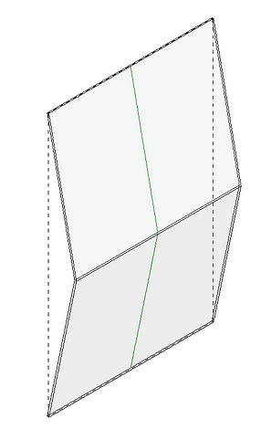
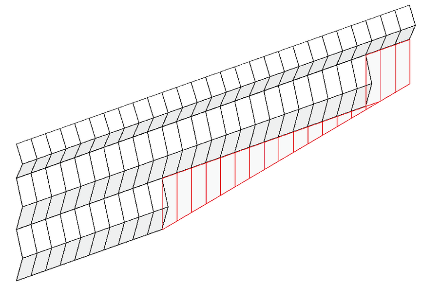
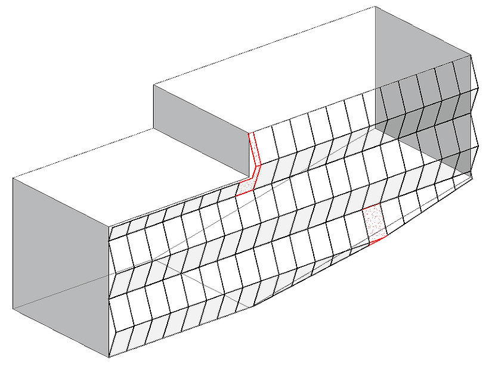
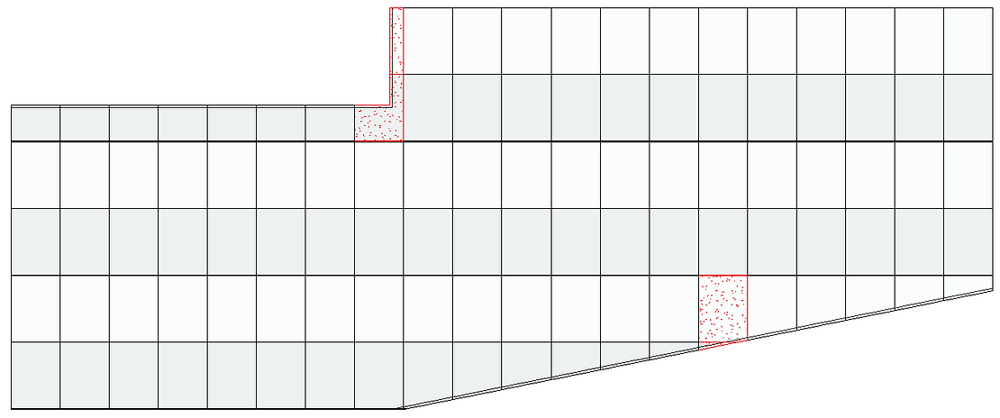
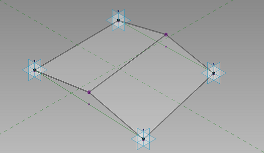
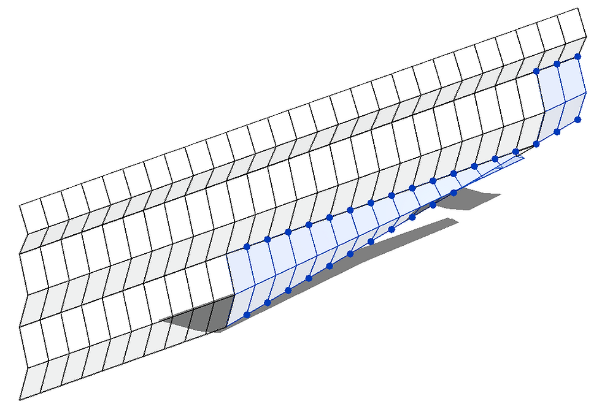
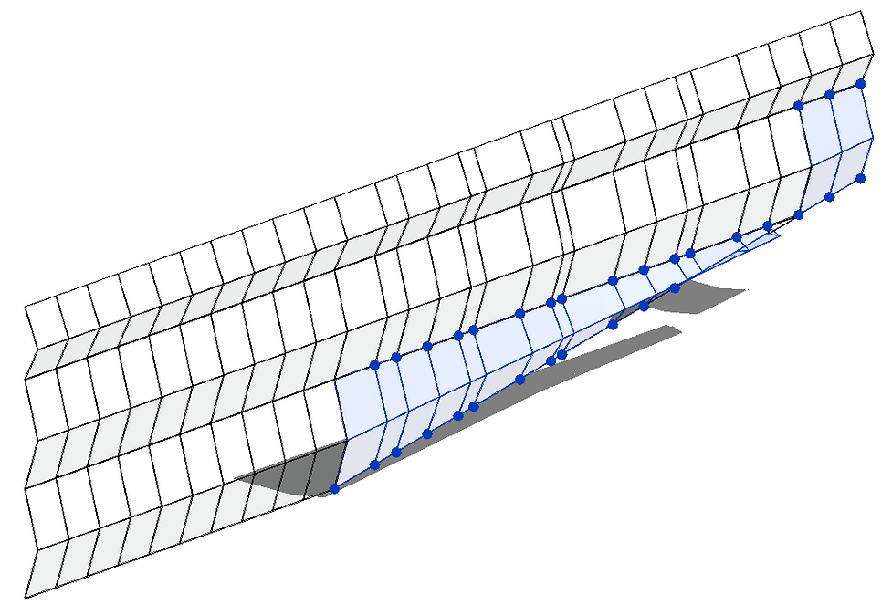

<!--
{"createdAt": "Nov 06, 2020",
"title": "Non-Rectangular Curtain Wall Panels",
"views": 1793,
"comments": [],
"votes": 2,
"published": true}
-->

# Non-Rectangular Curtain Wall Panels

No doubt, Curtain Walls are incredibly powerful elements and they definitely enhance the possibilities and the information in BIM model.

They can be customized in almost all their parts, providing several details both in 2D and 3D but, the most expert will know their weak points, at least one of them: Custom Curtain Wall panels CAN NOT suit a non rectangular shape.

For us in love with mathematical ratio, I would say:

> Achilles : CurtainWalls = Heel : NonRectangularCurtainPanel

We know that the only panels automatically placed in a curtain wall that can fit a non rectangular shape, are the System ones. But what if we want to keep the information and the geometry normally achieved with a custom curtain panel?

Well, the solutions provided by Revit for this situation are mainly 2:

- **Adaptive component pattern based**: Forget the CurtainWall and use a Pattern based on a Mass' surface. This solution will trim the panel's geometry that doesn't fit the specified dimensions.
- **Adaptive component point based**: This solution, instead of trim the geometry, will adapt the panel to the appropriate shape. Of course, an adaptive component 4 points based, is not suitable to cover areas whose perimeter polygon counts 3 or more than 4 points. You know, with great power come great responsibilities, this is a really powerful tool, we need to have some extra touches for it.

About the first solution we don't really need any automation, once you know how to deal with patterns, you're pretty much ready to go.

The second is where the fun start, since can be evaluated as an integration to the normal curtain wall, placing adaptive components with the intent or **replacing only the non rectangular curtain wall panels**.

## How To

The task is not very complicated, here the logic:

- Detect all the 4 edges panels
- Filter the non-rectangular ones
- Retrieve panels' vertices and sort them
- Place adaptive components
- Change the system panel with the Empty one.

This is a task that can be done manually but only by a tireless person that has a lot of time to spend on it.

With the use of a simple Dynamo graphic, we could be able to achieve the result way faster. Here a solution to perform all of these steps for a selected curtain wall:

## Case study

As in the majority of the situations, based on my experience, I think that creates a case study will make the topic way more clear, so, here we go, let's assume we want to have a curtain wall with a panel shaped such as this one, with one simple fold in the middle:

> :::image-small
>
> 

Creating it as a custom Curtain Wall Panel is pretty easy but won't solve the non rectangular situations, being replaced by a System panel. Below an example of a curtain wall with some non rectangular panels, painted in red.

> :::image-large
>
> 

Now let's focus on the two possible solutions listed above:

## Adaptive component pattern based

This method requires a Mass to be modeled to have a surface to divide. The division of the surface will give us the possibility of choosing between all the adaptive components patterns based in the project. All we will need to do is to select the adaptive component we modeled for the specific pattern, in this case, for the rectangular pattern.

Below the result, I paint in red the panels which I found more interesting because of their cut:

> :::image-large
>
> 

Wonderful, isn't it? Well, maybe, depending on the element could be a bit impractical "just cut" it but is definitely a quick solution!

**Curiosity: The issue**, in my opinion, is that the trim doesn't occur exactly where the Mass' face end. More precisely, the panels are trimmed with offset by approximately 55,5mm (2") out from the mass' edge.

> :::image-large
>
> 

It is a recognized issue, lots of people talking about that on the web but no answer pop up.

In this image, elevation of the façade above, the issue should be clear: every time a panel is cut, you see 2 lines, the inner one is the mass' edge.

## Adaptive component point based

This is the most interesting solution since it gives you more freedom and control over the elements to be placed. Modeling an adaptive component point based don't constraint you to any pattern neither its placement is limited on a mass' surface, it can be placed wherever you want.

I do believe you already know about these families but, just for completeness, I'll attach below a screen of the family I created for our study purpose (useless to say that everything is parametric in this family as well 😜):

> :::image-small
>
> 

As I wrote before, the goal is to place this family, in a very smart way, only where the custom curtain panel can't fit (the non-rectangular slot).

This solution allows everyone to work with the simple curtain walls and, when required, is possible to place all the non rectangular panels at once with very good control.

Here the result of the application of this method:

> :::image-large
>
> 

A simple curtain wall where just the non rectangular panel have been replaced using adaptive component (in blu)

Worked fine, right? Actually, you can see that a small panel has been skipped, that is because its boundary is a 3 edges polygon, we might solve this situation by adding a new branch to the dynamo graph dealing with 3 points based family.

I like this method mainly because gives us the possibility of playing with the grids and promptly update the adaptive component by running the same routine. Here if I move the vertical grids:

> :::image-large
>
> 

**Curiosity**: Not all the Panel boundaries represented by a Polycurve with more than 4 curves have to be excluded. Is important to know that, in case a curtain wall grid intersects a panel boundary, this one appears to split in two tangent curves. The last time I experienced the need to avoid these split lines, I created 𝑀⁴𝐵 PolyCurves.Simplify, this #Dynamo node reduces the number of curves of the Polycurve joining all the contiguous and tangent lines.

This post opens of course tons of questions because each façade, each case to be solved, could have several exceptions to be understood and fixed. I hope you found it all useful, for any question don't hesitate to contact me or leave a comment below!

Cheers!
