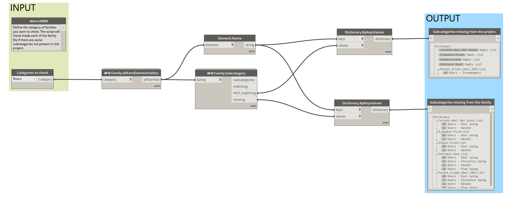
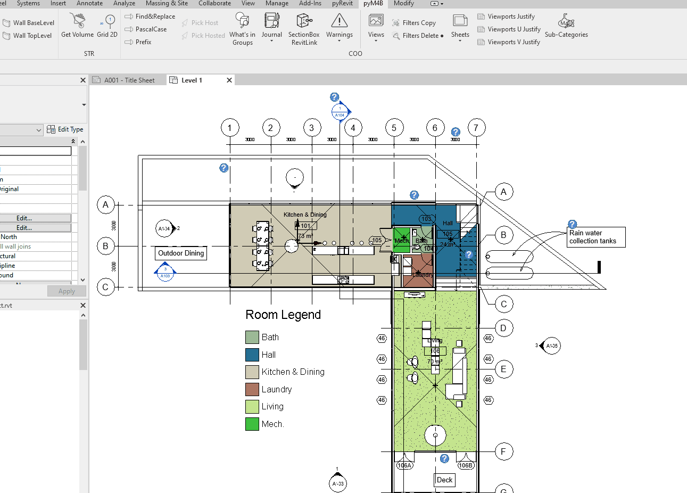

<!-- {
"createdAt": "Jan 01, 2025",
"title": "Control subcategories with Dynamo of pyRevit",
"tags": ["Dynamo", "Revit API", "Python", "pyM4B"],
"votes": 0,
"views": 1295,
"published": true
} -->

# Control subcategories with Dynamo of pyRevit

Hi all,  
Following from the previous post where the tool has been introduced, I wanted to show you how to let it work with a couple of solutions which I hope you're going to like!!

## 1. Dynamo Script

This script gives you the possibility of defining the Revit Category you want to analyze and instantly snoop through all the families in the model of the given category, checking if some of them have "bad subcategories" (in the family but missing from the project). of "missing categories" (in the project but missing from the family)

You can check from the snip below how it is structured, effortless, and effective.

> :::image-large
>
> 

A nice fact is that Dictionaries have been used as output because they are displayed by Dynamo in a way that I think much appropriate for the purpose: the **keys** are the family names and the **values** are the subcategory missing from the family itself or from the project, depending on the output.

## 2. pyM4B

To be honest, this is the method I like the most because of the **simplicity** to use and the **UI**, inspired by the splendid work of @eirannejad! 
It's splendid how this tool can quickly overview all the families of the same category in the model. Here is a GIF!!

The material is of course all open-source and downloadable from Github! 😁

> :::image-large
>
> 

---

The only problem you might encounter with both methods is related to the families, if some give **errors** (the classic ones you see at the opening of the family saying things like "Constraint are not satisfied..."). In this case, the traditional Revit pop-up will appear on the screen, and the script will **pause until you pass/cancel the pop-up**. 
I'm sure, and I hope that none of your families have such an error but, if so, we can consider these solutions as a DOUBLE CHECK on the families!!

> :::image-small
>
> Two birds with one stone?
>
> 

Short and straight to the point, like the solutions above!! 😎

Read you soon, 
Cheers,
