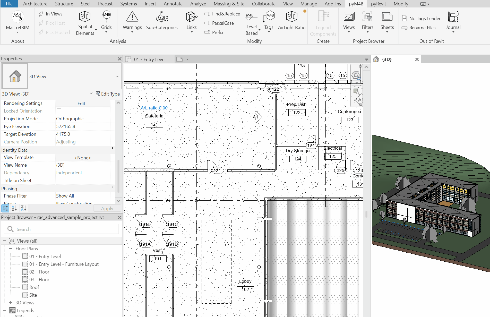

<!-- {
"createdAt": "Aug 7, 1993",
"title": "first Post",
"tags": ["Dynamo", "Revit API", "Python"],
"votes": 0,
"views": 0,
"published": false
} -->

# Air/Light Ratio with Revit

Hi all,

In today's post, we are going to illustrate a solution developed with a friend that permits to automatically calculate the air/light ratio for all the rooms in a Revit project.

## How to

### Ideal workflow

For architects to efficiently calculate the air/light ratio, the requirements are:

- the Rooms on which to perform the calculation.
- the Windows, Doors and/or Curtain Panel to consider.
- the Parameters for the above category which inform about the correct areas.

### pyM4B implementation

No manual calculation is needed... after a few inputs:

1. The project phase on which to operate.
2. Pick the Rooms on which to perform the calculation.
3. Specify the parameters about:
   - Rooms - area parameter to fill with the sum of all openings areas.
   - Rooms - Numeric parameter to fill with the calculated ratio
   - Windows - area parameter to read
   - Doors - area parameter to read
   - Curtain Panels - area parameter to read

If you don't want to read parameters for one of the opening categories, just select the "<span style= "color: red">---</span>" input.

> :::image-large
>
> 

Since we don't like to return answers without complete explanations, at the end of the air/light calculation, it is possible to export additional data to **CSV**. The reason why we choose CSV instead of a window directly in Revit is because a CSV export is both faster and more secure (the pyRevit output window, if overloaded, might crash your Revit session 😅)

Once defined the desired CSV file name, the script will create 2 different files

- [your name] - summary.csv
- [your name] - detail.csv

Here is a short extract, with a description, of both:

**_[your name] - summary.csv_**
| Room | Openings | Floor | Ratio |
| ---------------------- | ---------------- | ------------ | ------- |
| _Room Name and Number_ | _Vertical Areas_ | _Floor Area_ | _Ratio_ |
| ---- | ------- | ------ | ----- |
| Vest. 101 | 51.70 | 38.66 | 1.33 |
| --- | --- | --- | --- |
| ... | ... | ... | ... |
| --- | --- | --- | --- |

**_[your name] - detail.csv_**
| Room | Family Instance | Area |
| --- | --- | --- |
| _Room Name and Number_ | _[id] Family&Type Name_ | _Family Area_ |
| --- | --- | --- |
| Vest. 101 | [145548] System Panel: Glazed | 2.29 |
| --- | --- | --- |
| ... | ... | ... |
| --- | --- | --- |

---

## Want to know some back scenes?

A couple of <span style = "color: yellow">curiosities</span> which I'd like to list, challenges that popped out during the development of this function.

**1. why to select project phase?**
As you know, Rooms don't quite have phases; a room can only exist in one phase. Therefore, to ease the element selection and avoid possible wrong selection, we need to specify the phase so that we always have a handy filter to apply to our FilteredElementCollector().

**2. how can the script detect the exterior opening?**
By default, Revit has the Properties .FromRoom and .ToRoom, however, they <span style = "color: red">might not be accessible</span>, depending also on the way the family is built, or the thickness of the wall.

We prepared a function, called below <span style="color:green">get_adjacentRooms()</span>. What it does is to calculate the central point for each openings (e, in the script below) and iterate through all the rooms, collecting the ones at a specific distance from the element. In the case the function return only 1 room, then we consider that element (e) as and external opening.

**3. tell me more about the performance enhancement.**
In order to permit a quick execution also in large project, we tried to limit as mus as possible the amount of element to be collected per each room. This is possible as per every room we are collecting element using 3 filters:

- Phase Filter
- Multicategory Filter
- BoundingBox Filter

```python
# PHASE FILTER
# phase = phase selected by the user
phase_filter = DB.ElementPhaseStatusFilter(phase.Id,
                                           List[DB.ElementOnPhaseStatus]([DB.ElementOnPhaseStatus.New,
                                                                          DB.ElementOnPhaseStatus.Existing]),
                                           False)

# CALCULATE ADJACENT ROOMS
def get_adjacentRooms(e, all_rooms=all_rooms):
    bb = e.get_BoundingBox(None)
    pt = DB.Line.CreateBound(bb.Min, bb.Max)
    pt = pt.Evaluate(0.5, True)
    pt1 = pt.Add(e.FacingOrientation.Multiply(2))
    pt2 = pt.Add(e.FacingOrientation.Multiply(-2))
    out = []
    for r in all_rooms:
        if r.IsPointInRoom(pt1):    out.append(r.Id)
        if r.IsPointInRoom(pt2):    out.append(r.Id)
        if len(out) == 2:   break
    return out

# MULTICATEGORY AND BOUNDING BOX FILTER
multicat = [BIC.OST_Windows, BIC.OST_Doors, BIC.OST_CurtainWallPanels]
multicat = DB.ElementMulticategoryFilter(List[DB.BuiltInCategory](multicat))
bb = room.get_BoundingBox(None)
boundingBox_filter = DB.BoundingBoxIntersectsFilter(DB.Outline(bb.Min, bb.Max), 3)
# get all interesting openings
openings = DB.FilteredElementCollector(doc).WherePasses(phase_filter)\
                                           .WherePasses(multicat)\
                                           .WherePasses(boundingBox_filter)
```

---

And that's all,

I hope you found this content useful and enjoyable... or at least _enlightening_!

> :::image-small
>
> 

Cheers!
